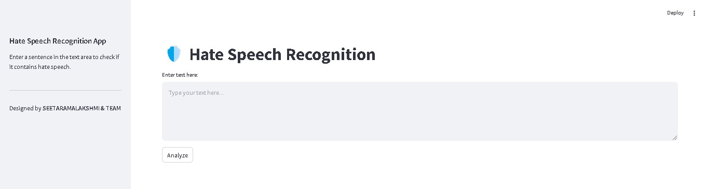

# Hate Speech Recognition Project

## Overview
The Hate Speech Recognition project is a sentiment analysis tool designed to identify whether a given text contains hate speech, offensive language, or neutral content. The project focuses on understanding the context and overall sentiment of the text rather than relying solely on predefined keywords. This project also aims to stop the posting of offensive comments on social media.

## Features
- **Streamlit GUI Interface**: Provides a user-friendly interface for classification and interaction.
- **Contextual Analysis**: Classifies text based on the overall sentiment and intent.
- **Contextual Profanity Detection**: Avoids blanket classification of texts with offensive words if the context is non-harmful.
- **Impact Analysis**: Distinguishes between positive and negative impacts of the sentences.
- **Dynamic Sentence Evaluation**: Automatically processes full sentences and paragraphs.
- **Profanity Check Library**: Detects offensive words effectively.

## Example Classifications
- "You are a big motherf****r": Offensive
- "We should not use words like motherf****r as it is a curse word": Non-offensive
- "Tribes are second grade citizens": Negative impact
- "Tribes are treated as second grade citizens, so the government has brought many schemes to uplift them": Positive impact

## Technologies Used
- **Programming Language**: Python
- **GUI Framework**: Streamlit
- **Profanity Detection**: Profanity Check Library
- **Machine Learning**: DecisionTreeClassifier
- **Data Preprocessing**: Text cleaning and tokenization

## Dataset
The project uses a Twitter database for training the Decision Tree model.

## File Structure
- `model.py`: Contains the core logic for data processing, feature extraction, and model training.
- `dataset.csv`: The Twitter database used for training and testing the model.
- `requirements.txt`: List of Python dependencies required for the project.

## Installation
1. Clone the repository:
   ```bash
   git clone <repository-url>
   ```
2. Navigate to the project directory:
   ```bash
   cd hate-speech-recognition
   ```
3. Install dependencies:
   ```bash
   pip install -r requirements.txt
   ```

## Usage
1. Prepare your dataset in the `twitter_data.csv` file.
2. Launch the Streamlit app:
   ```bash
   streamlit run app.py
   ```
3. Use the GUI to input sentences for classification.

## Project Outputs
Below are some visual outputs of the project:

### Streamlit GUI Interface


### Example Classification Results
(images/output1.jpg)

## Future Enhancements
- Support for multilingual text analysis.
- Improved model accuracy with advanced deep learning techniques.
